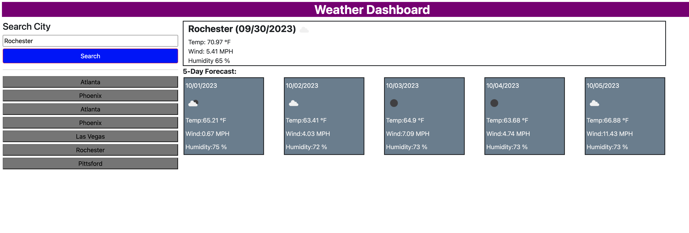

# SB-Challenge-6-ASU

Build a weather display page for a city

Build a weather display that shows 5 day forcast

Store the city names in local storage

Create quick button look up links for past cities

Don't resave the city if it is already saved in history

Will need an API key for Open Weather inorder to call the api 

verify both api urls for single and multiple day lookups

URL - 

